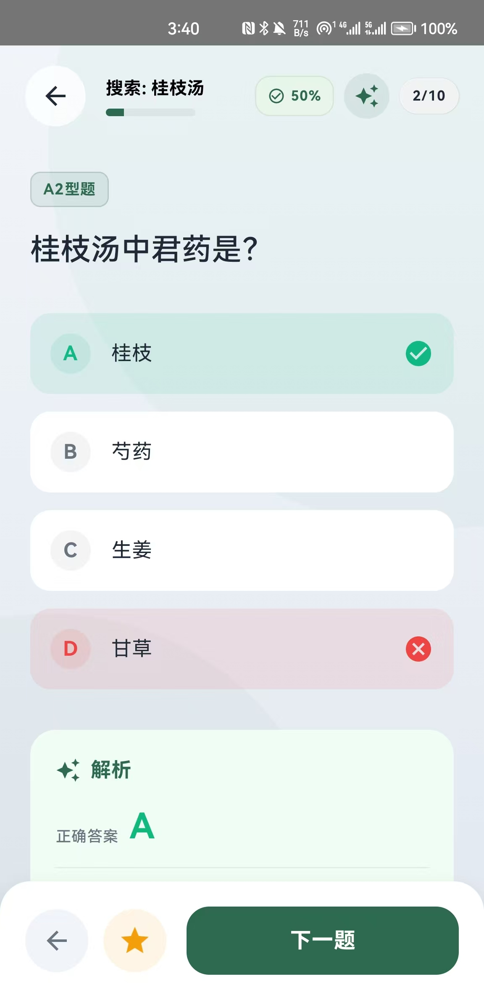
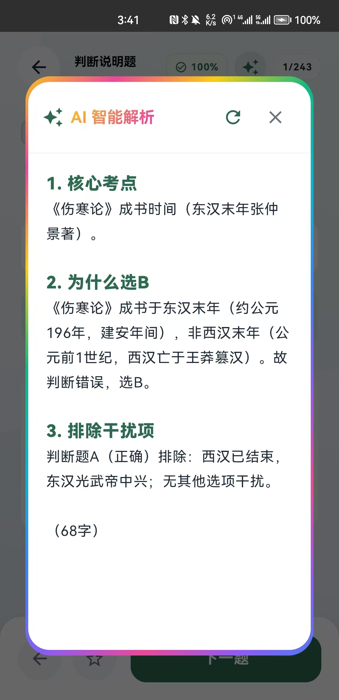
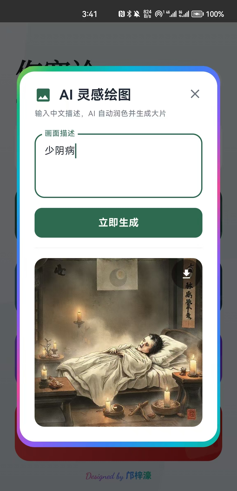
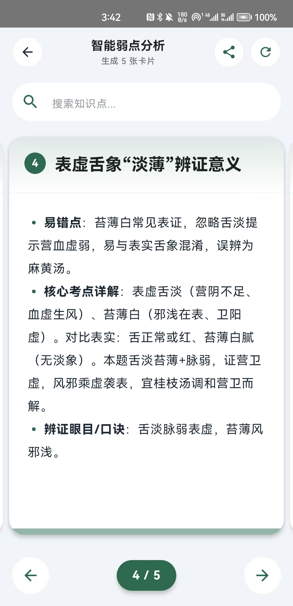
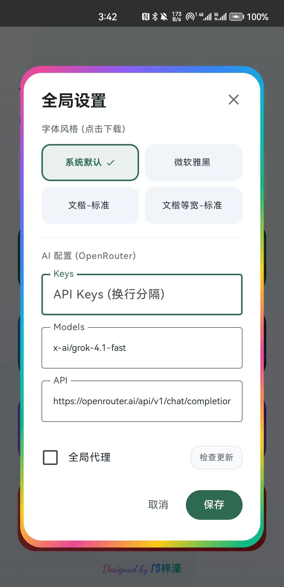
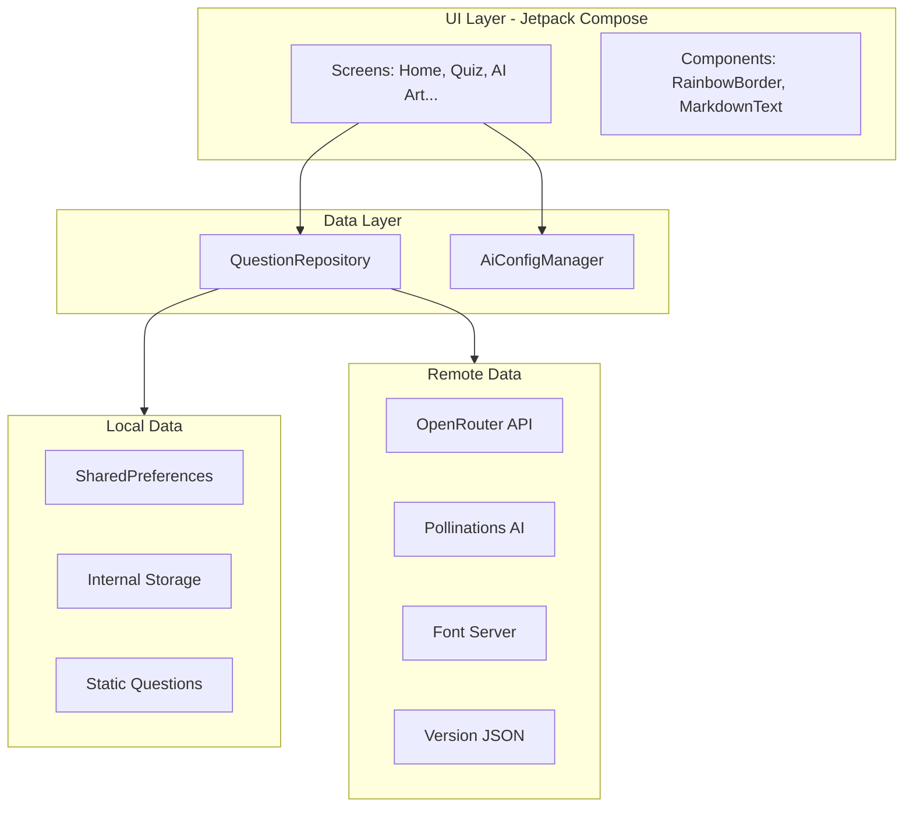

# 🌿 伤寒论刷题宝典
### ShangHanLun Quiz

**古籍新研 · 智启未来**
 
*结合传统中医经典与前沿 AI 技术的智能辅助学习平台*

[核心特性](#-核心特性) • [应用预览](#-应用预览) • [技术架构](#-技术架构) • [版本历史](#-版本迭代) • [快速开始](#-快速开始)

---

## 📖 项目简介

**伤寒论刷题宝典** 是一款专为中医执业医师考试及考研学生打造的 Android 智能助教应用。

区别于传统死板的题库 App，本项目深度集成了 **LLM (大语言模型)** 能力。它不仅能提供标准题库，更能通过 AI 实时生成新题、提供苏格拉底式深度解析、绘制中医意象图以及生成个性化复习卡片。配合独有的“禅意绿” Material 3 设计语言与流光特效，让枯燥的刷题过程变成一种视觉与知识的双重享受。

---

## 📱 应用预览

> *UI 采用 Material Design 3 规范，适配深色模式与手势导航。*

|                  **1. 禅意首页**                   |                     **2. 联网动态出题**                     |                     **3. 沉浸式答题**                     |
| :------------------------------------------------: | :---------------------------------------------------------: | :-------------------------------------------------------: |
|  |  |  |
|            *流光特效入口，实时错题统计*            |                  *输入关键词，AI 现场出题*                  |                *流式打字机解析，智能助教*                 |

|                  **4. AI 灵感绘图**                  |                  **5. 智能弱点分析**                   |                   **6. 设置与字体**                    |
| :--------------------------------------------------: | :----------------------------------------------------: | :----------------------------------------------------: |
|  |  |  |
|             *自然语言转绘，生成高清插画*             |             *生成复习卡片，支持 PDF 导出*              |               *多字体按需下载，代理配置*               |

---

## ✨ 核心特性

### 🧠 **AI 核心赋能**
- **♾️ 无限题库生成**：基于 `OpenRouter` 接口，输入“太阳病”、“小柴胡汤”等关键词，AI 实时生成符合考研难度的题目（单选/多选/判断/简答）。
- **💬 Socratic 智能解析**：答题过程中可随时唤起 AI 助教，获得基于原文条文的深度辨证解析，支持流式输出（Streaming）降低等待焦虑。
- **🎨 视觉化记忆辅助**：集成 `Pollinations.ai`，通过 NLP 技术自动润色提示词，将中医抽象概念转化为生动图像，支持一键保存至系统相册。
- **📊 弱点靶向治疗**：AI 智能分析错题记录，自动提炼“易错点”与“辨证眼目”，生成结构化的知识复习卡片。

### 🛡️ **工程化与体验**
- **🔄 数据一致性闭环**：构建了 Repository 与 Manager 层的双向同步机制。**（v3.13 修复）** 删除联网题库章节时，首页错题统计与进度记录毫秒级同步清理，杜绝脏数据。
- **🚀 轻量化资源管理**：中文字体（如霞鹜文楷）采用**按需下载**策略，结合断点续传与前台服务通知栏进度显示，极大压缩 APK 体积。
- **💎 现代化 UI/UX**：
    - 全局应用 **RainbowBorder**（彩虹流光边框）特效组件。
    - 细腻的微交互动画。
    - 完整的异常处理与 Toast 反馈机制。

---

## 🏗️ 技术架构

本项目采用现代 Android 开发架构 (MAD)。

- **语言**: Kotlin
- **UI 框架**: Jetpack Compose, Material3
- **图片加载**: Coil
- **网络**: HttpURLConnection + Coroutines Flow
- **数据序列化**: GSON
- **架构模式**: MVVM (Repository Pattern)

------

## 📅 版本迭代

### v3.13 (Current) - 体验重塑与绘图公测

- **✨ [新增] AI 灵感绘图**：
  - 新增 `AiImageDialog`，支持自然语言转绘。
  - 集成 Coil 图片加载引擎与正则提取算法。
  - 实现图片一键保存至系统相册（适配 Android 10+ Scoped Storage）。
- **🐛 [修复] 数据一致性核心修复**：
  - 重构 `QuestionRepository` 删除逻辑。
  - 修复了删除“联网搜索”题库后，首页错题计数器未同步减少的严重 Bug。
  - 为 `MistakeManager` 和 `ProgressManager` 增加了批量清理接口。
- **💄 [优化] UI 统一**：
  - 将“设置”、“使用说明”、“彩蛋”及“绘图”弹窗统一升级为 **RainbowBorderDialogSurface**。
  - 优化设置页面布局，升级检查更新按钮样式。

### v3.10 ~ v3.12 - 联网能力与字体

- **🚀 联网刷题上线**：实现了基于关键词的 AI 动态出题功能，支持题型混合生成。
- **📥 字体按需加载**：引入 `FontManager`，支持 8 种中文字体的在线下载与热切换；实现前台服务通知栏下载进度条。
- **🛠️ 网络层升级**：新增全局 HTTP 代理设置，方便特定网络环境使用。

### v3.5 ~ v3.09 - 弱点分析与基础建设

- **📄 PDF 导出**：支持将 AI 生成的弱点分析卡片渲染为高清 PDF 并调用系统分享。
- **🔍 搜索功能**：在弱点分析页面增加本地搜索与快速跳转。
- **🏗️ 架构调整**：引入 MVVM 思想，分离 `Data` 层与 `UI` 层；封装 `MarkdownText` 组件。

------

## 🚀 快速开始

### 1. 下载安装

前往 [https://github.com/Anyeling0620/Shanghanlun/releases] 页面下载最新版本的 APK 安装包。

### 2. 配置 AI (首次运行)

由于应用强依赖 AI 功能，首次使用请进行配置：

1. 在首页点击 **“设置”** (齿轮图标)。
2. 在 **"Keys"** 输入框填入你的 API Key (支持 OpenRouter 或兼容 OpenAI 格式的 Key)。
3. *(可选)* 勾选 **“全局代理”** 并填入 Host 和 Port（例如 `127.0.0.1` : `7890`）。
4. 点击 **“保存”**。

### 3. 开始学习

- 点击 **“联网刷题”**，输入“少阳病”，设置生成 5 道题，开始挑战。
- 点击 **“AI 绘图”**，输入“采药童子”，体验 AI 生成插画。

------

## 🤝 贡献

欢迎提交 Issue 或 Pull Request！如果您有好的想法，比如增加新的题型或接入更多的 AI 模型，请随时告诉我。

## 📜 开源协议

Copyright (c) 2025 **Anyeling**. 本项目采用 [MIT License](https://www.google.com/search?q=LICENSE) 开源。

------

Made with ❤️ by <a href="https://github.com/Anyeling0620">Anyeling</a>
